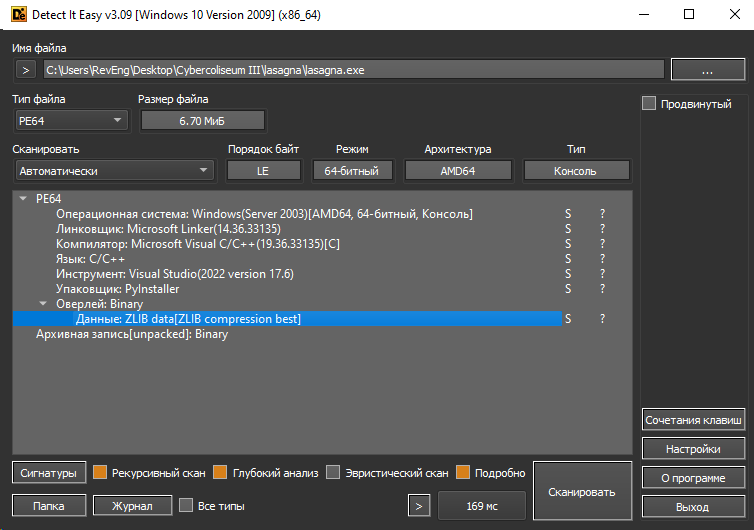
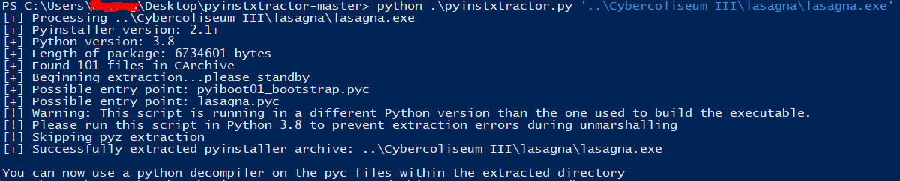
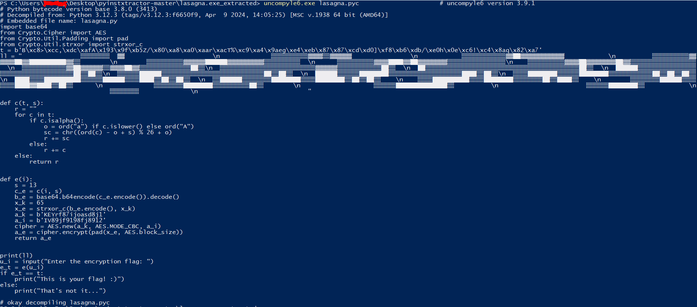
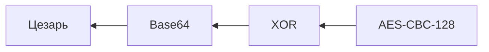

| Название | Категория |        Сложность         |
| :------: | :-------: | :----------------------: |
| Лазанья  |  Реверс   | $${\color{green}Легко}$$ |

[Файлы](give) для задания

## Анализ программы

Запихнем программу в Detect It Easy



В качестве упаковщика указан PyInstaller, что говорит о том, что программа написана на языке Python. Для того, чтобы получить код программы, нам надо распаковать и декомпилировать программу. Для такой операции существуют два инструмента:

- [pyinstxtractor](https://github.com/extremecoders-re/pyinstxtractor) для распаковки бинарника
- [uncompyle6](https://pypi.org/project/uncompyle6/) для декомпиляции pyc файла





Перенесем вывод uncompyle6 в файл lasagna.py

## Реверс

После декомпиляции получили следующий код


Видим, что есть две переменные t и ll:

- t - зашифрованный флаг
- ll - баннер
  Две функции c и s:
- c - шифр Цезаря
- e - функция многоступенчатого шифрования
  Программа нас просит ввести флаг, потом ввод проходит через следующую цепочку шифрования:


Цезарь шифрует только буквы латинского алфавита.

## Расшифровка флага

Для дешифрации флага надо сделать всю эту цепочку в обратном порядке:



[Решение](solve.py)

## Флаг

```
CODEBY{L@sAgna_aND_2ncr3pt1on}
```
