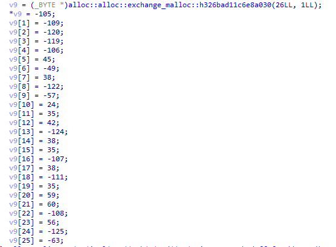

|  Название  | Категория |          Сложность          |
| :--------: | :-------: | :-------------------------: |
| Ржавый АРМ |  Реверс   | $${\color{yellow}Средний}$$ |

[Файлы](give) для задания

## Анализ

Пихаем бинарник в Detect It Easy


Как видно, программа написана под архитектуру Android. Больше ничего интересного, поэтому переходим к реверсу

## Реверс

Реверсить буду в IDA Pro
Среди всего этого беспорядка (как бывает в бинарниках на Rust) находим функцию main


Видим, что вызывается функция main в namespace task. Зайдем в нее
Из всего интересного там есть только переменная v9, которая сравнивается с вводом пользователя



Скорее всего это есть флаг, но зашифрованный.
Среди списка функций в IDA можно обнаружить, что в namespace task есть ещё одна функция


В ней можно увидеть следующее


Похож на систему шифрования. Попробовав первые символы флага CODEBY, получил значения, равные первым шести символам в массиве v9. Обратим эту формулу, чтобы расшифровать флаг. Получается следующая формула:

```
(((flag[i] ^ 69) - 156 ^ 69) - 48) % 256
```

[Решение](solve.py)

## Флаг

```
CODEBY{R2sT_f0R_ARM_wh@t?}
```
