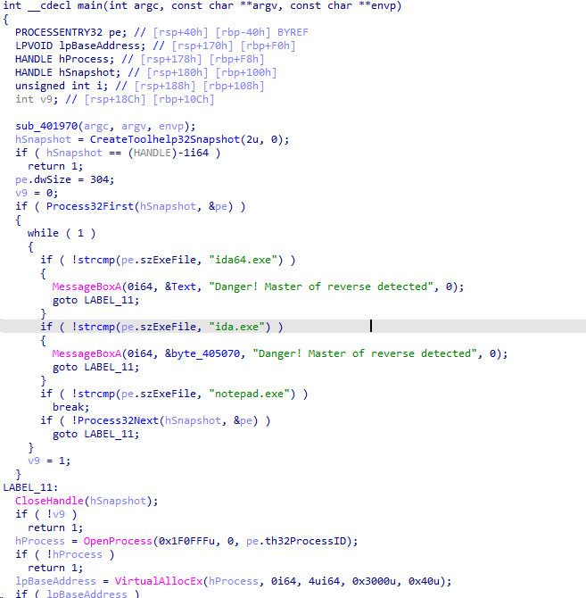

|   Название   | Категория |          Сложность          |
| :----------: | :-------: | :-------------------------: |
| Чужая память |  Реверс   | $${\color{yellow}Средний}$$ |

[Файлы](give) для задания

## Анализ

Запихнем бинарник в Detect It Easy


Видим, что бинарник без сюрпризов, поэтому переходим к реверсу

## Реверс

Реверсить буду в IDA Pro




Как видно, в программе прописана защита от IDA, но запускать дебаг не придется, потому что тут и так все понятно, что к чему.
Данная программа находит процесс notepad.exe, вписывает в ее память данные из переменной byte_404020. Перед тем как инжектнуть элементы этой переменной, из каждого элемента вычитывается 48.
Элементы переменной byte_404020:


Как я говорил, запускать не придется, мы можем сдампить эту переменную и вручную или на питоне из каждого полученного байта вычесть 48.
Пример на питоне:

```python
a = '78 BD 4D 57 30 30 30 78 F7 F1 30 30 30 30 78 F7 F1 30 30 30 30 78 F7 F7 5F 30 30 30 B0 5C 3B B0 78 2F F1 78 69 29 A5 24 C0 30 30 30 30 30 F3 FF F4 F5 F2 09 2B 03 E0 1D 15 1F 1E F5 0F 15 1C D4 15 0F 23 0F 1D E2 1D 1F 22 09 0F E1 23 0F 23 27 15 E2 24 0F F0 23 0F 18 FF 1E E2 29 2D'.split()
b = [int(i, 16) for i in a]
b = [i - 48 for i in b]
b = bytearray(b)
with open('extracted.bin', 'wb') as f:
	f.write(b)

```

Казалось бы, что мы получили флаг, но нет. На самом деле это очередной бинарник. Откроем его в IDA Pro без проведения анализов.


Открываем в режиме 64-bit. Видим просто поток HEX. Выделяем все до пяти пар нулей и прожимаем клавишу C затем кнопку Force. Получаем следующий дизассемблированный код


Но у нас остались ещё байты после пяти пар нулей. Это и есть флаг, только зашифрованный. Из дизассемблированного кода узнаем, что из каждого из них надо вычесть 128.

[Решение](solve.py)

## Флаг

```
CODEBY{S0meonE_el$e_s_m2morY_1s_swe2t_@s_hOn2y}
```
