| Название | Категория |        Сложность        |
| :------: | :-------: | :---------------------: |
|   VMM    |  Реверс   | $${\color{red}Сложно}$$ |

## Распаковка программы

Проведем первичный анализ полученной программы в Detect It Easy

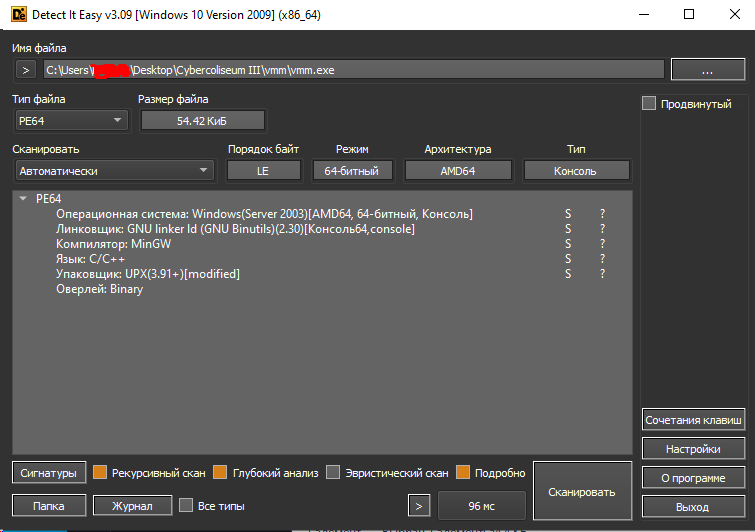

Как видно на выводе, программа написана на языке C/C++ и упакована UPX версии 3.91 и выше. Его следует распаковать, потому что реверсить упакованные программы крайне проблематично. Но распаковать не получится, так как его сигнатура изменена, о чем и говорит Detect It Easy.

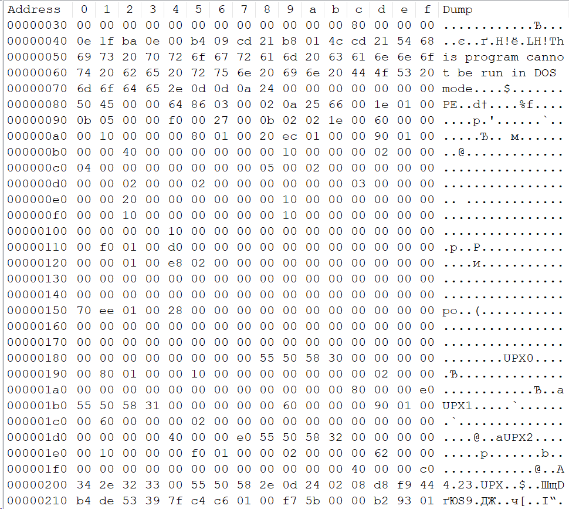

В HEX видно, что тут используется UPX версии 4.23 и в последнем UPX не хватает восклицательного знака в конце. Должно выглядеть так

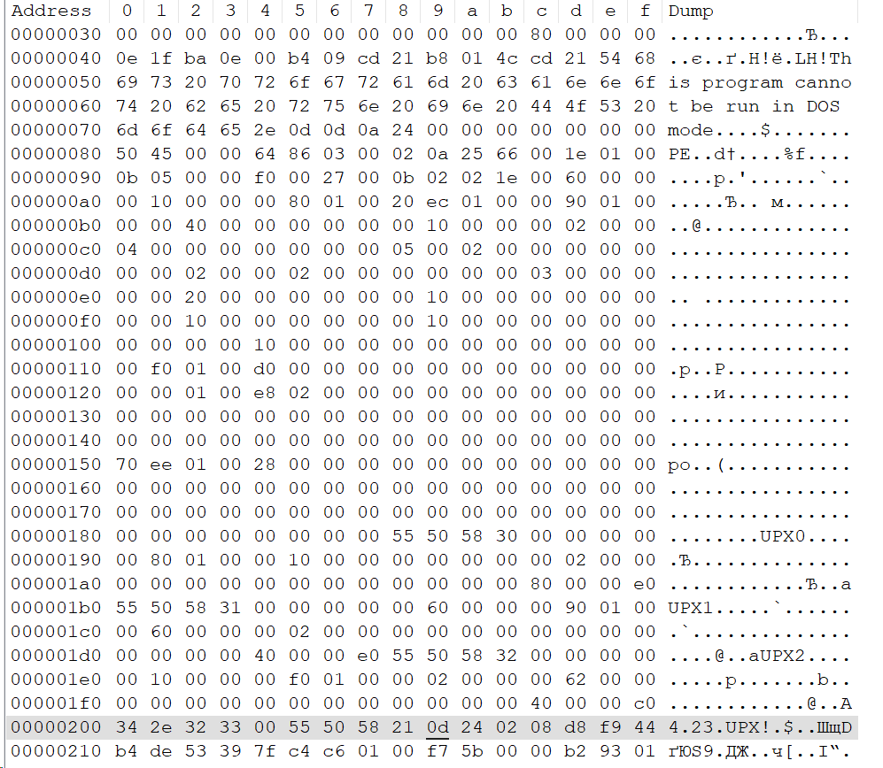

После сохранения изменений, Detect It Easy отображает следующую информацию об упаковщике

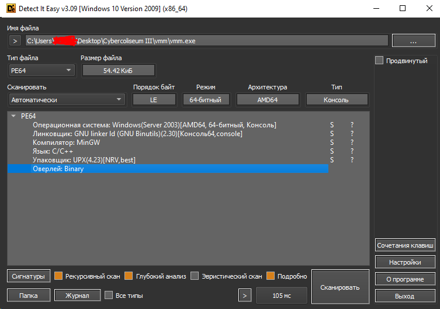

Скачав нужную версию UPX распаковываем программу.

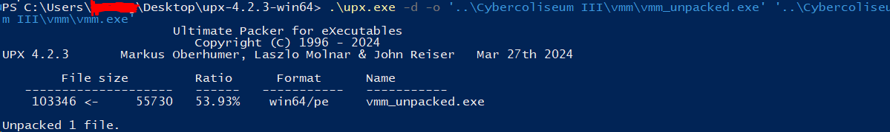

Проверяем в Detect It Easy

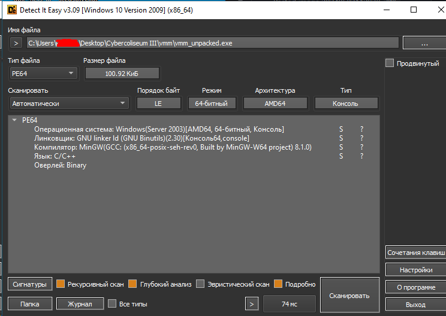

Программа распакована, можем приступать к реверсу.

## Реверс программы

Для реверса буду использовать IDA Pro
Первое, на что натыкаемся при открытии программы, это куча непонятных функций и функция main. В нее и заглянем.

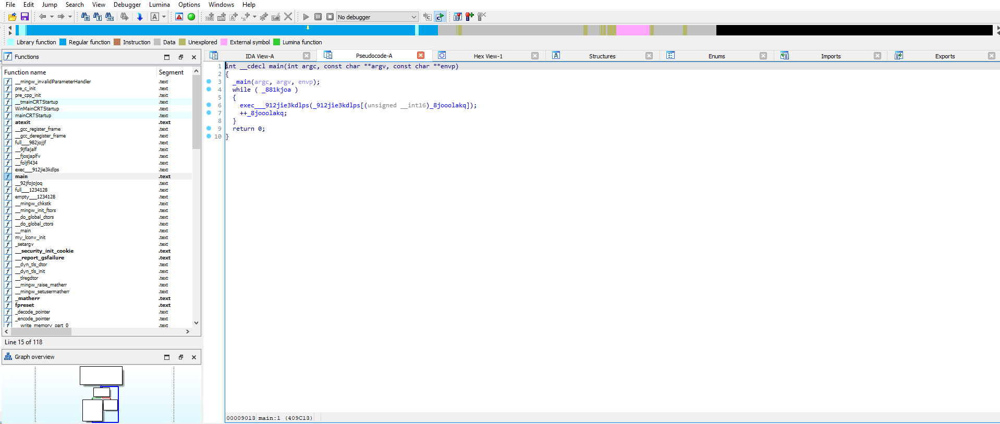

Как видно, эта функция циклически вызывает функцию exec\_\_912jie3kdlps, отправляя в него элемент из массива \_912jie3kdlps. Индекс - переменная \_8jooolakq, которая инкрементируется после каждого выполнения функции exec. Цикл работает до тех пор, пока переменная \_881kjoa не примет значение, соответствующее false.
Заглянем в функцию exec\*\*\*912jie3kdlps. Функция большая, так что скрины кидать не буду. Просмотрев функцию, видно, что аргумент a1 является кодом операции. Статически провести анализ будет проблематично, так что проанализируем программу в режиме дебаггинга. Дебаггер поставил Local Windows debugger.
При запуске программы видим следующее:

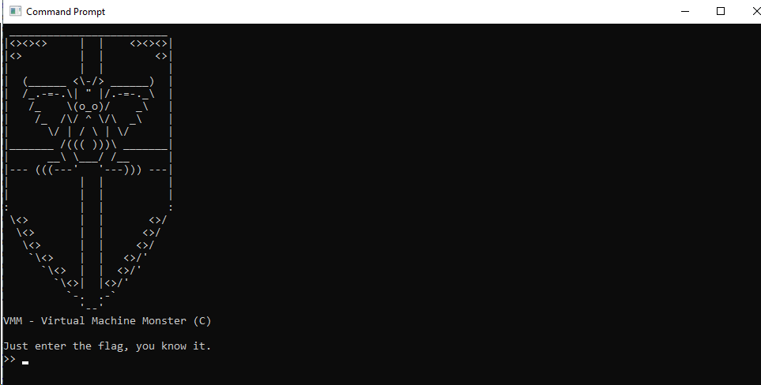

Она просит нас ввести флаг, который мы не знаем...
Программа приостановилась на ожидание ввода, так что установить место, где остановились, не получится.
В функции exec есть следующий кусок

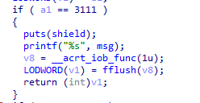

При коде 3111 выводится некое сообщение в консоль, которая и является баннером

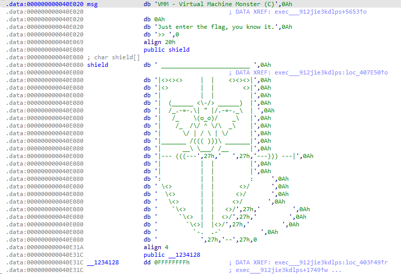

Поставим первую точку останова тут. В итоге, программа остановилась в ожидании вода здесь

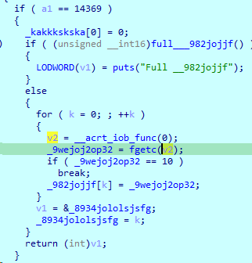

Переменная \_9wejoj2op32 побайтово берет ввод и пока не встретил символ возврата каретки, символы заливаются в массив \_982jojjf. Для удобства массив переименую в input_flag. После этого функция делает возврат и main вызывает его вновь с новым кодом исполнения.
Прекращаем дебаггер и начинаем искать переименованный массив в функции exec.
Первое, что я нашел, это этот кусок

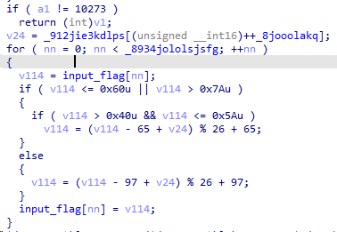

Тут видим, что некоторые символы ввода шифруются ключом, который находится в массиве кодов \_912jie3kdlps, что говорит о том, что там могут находиться и ключи шифрования. Проанализировав код, видим, что в вводе символы латинского алфавита шифруются шифром Цезаря. Шифруются так:

```C++
// Буквы верхнего регистра (ASCII-код буквы A - 65)
v114 = (v114 - 65 + v24) % 26 + 65;
// Буквы нижнего регистра (ASCII-код буквы a - 97)
v114 = (v114 - 97 + v24) % 26 + 97;
```

Другие символы (скобки, цифры, нижние подчеркивания) этим алгоритмом не шифруются.
Далее наткнулся на этот участок

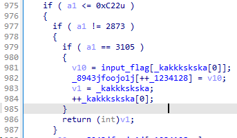

В ещё один массив \_8943jfoojo1j вставляется символ из ввода. Скорее всего массив буферный. Для удобства переименую в buffer.
Далее обращения к input_flag нет, теперь будем искать обращения к переменной buffer.
Первый найденный участок

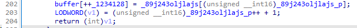

В него вставляется ещё один элемент из массива \_89j243oljlajs. Что в этом массиве, узнаем позже.

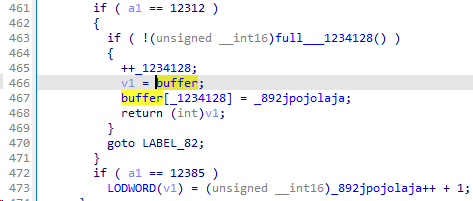

Тут в буфер ещё вставляется переменная \_892jpojolaja.

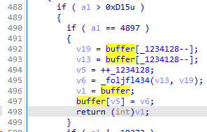

Тут из буфера забираются два последовательных элементах, которые отправляют в функцию \_foljfl434. Результат его исполнения вставляется обратно в массив buffer.
Взглянем на эту функцию

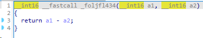

Эта функция производит вычитание двух аргументов и отправляет результат. Для удобства переименую функцию в sub.

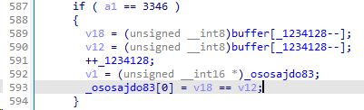

Далее наткнулся на этот участок. Тут происходит сравнение двух элементов из массива buffer в формате беззнакового байта. Для удобства переменная \_ososajdo83 будет переименована в cmp

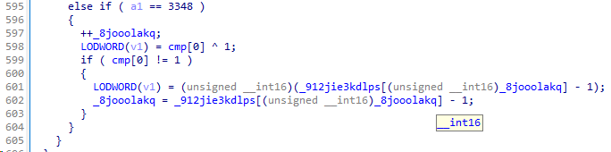

Ниже проверяется полученный результат сравнения

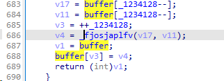

Дальше нашел этот участок, который срабатывает при a1 равный 2871. Тут происходит то же самое, что и при вызове функции sub, но вызывается другая функция.

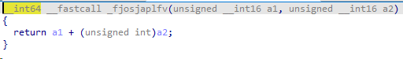

В этом случае функция просто суммирует два аргумента. Переименую функцию в sum.

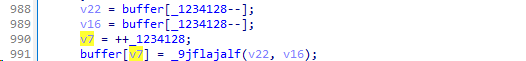

Далее находим этот участок, где вызывается функция \_9jflajalf.

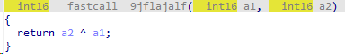

Эта функция XORит два своих аргумента.
Далее ничего интересного, связанного с переменной buffer не было найдено.
Проанализируем массив \_912jie3kdlps.

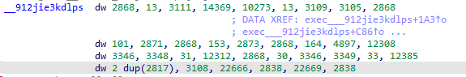

Как видим, в ней содержатся коды операций и ещё какие-то числа, которые не встречаются в if'ах функции exec.
Снова проведя дебаггинг узнаем следующую информацию:

- 14369 - запрос ввода пользователя
- 13 - ключ для шифра Цезаря
- 3105 - шифрование шифром Цезаря
- 2868 - внесение в буфер ключа шифрования
- 101 - первый ключ
- 153 - второй ключ
- 164 - третий ключ
- 2871 - шифрование первым ключом (сложение)
- 2873 - шифрование вторым ключом (XOR)
- 4897 - шифрование третьим ключом (вычитание)
- 12308 - берем зашифрованный символ из флага
- 3346 - проверка, что зашифрованный введенный символ соответствует зашифрованному символу флага
- 3348 - проверка сравнения
- 22666 - флаг верно введен
- 22669 - флаг введен неверно
- 2838 - выход из программы

  И теперь мы понимаем, что массив \_89j243oljlajs - это флаг, который надо расшифровать.
  Получается следующее - ввод пользователя шифрует латинские буквы шифром Цезаря, потом каждый символ ввода проходит шифрование тремя ключами, после чего сравнивается с символом флага, соответствующий его индексу. Такая операция происходит циклически, пока не будет пройден весь ввод. Но если найдется несоответствие, то программа выведет сообщение, что флаг неверен и выйдет.
  В итоге шифрование происходит по следующим формулам:

```python
# Верхний регистр латиницы
input_flag[i] = ((((input_flag[i] - 65 + 13) % 26 + 65) + 101 ^ 153) - 164) % 256
# Нижний регистр латиницы
input_flag[i] = ((((input_flag[i] - 97 + 13) % 26 + 97) + 101 ^ 153) - 164) % 256
# Остальные символы
input_flag[i] = ((input_flag[i] + 101 ^ 153) - 164) % 256
```

Флаг находится здесь

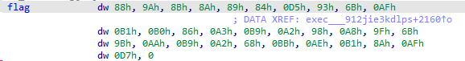

## Расшифровка флага

Для дешифровки флага надо обратные формулы:

```python
# Верхний регистр латиницы
input_flag[i] = ((((input_flag[i] + 164 ^ 153) - 101) % 256) - 65 - 13) % 26 + 65
# Нижний регистр латиницы
input_flag[i] = ((((input_flag[i] + 164 ^ 153) - 101) % 256) - 97 - 13) % 26 + 97
# Остальные символы
input_flag[i] = ((input_flag[i] + 164 ^ 153) - 101) % 256
```

[Решение](solve.py)

## Флаг

```
CODEBY{V1rtuAl_m@ch1Ne_m0nstEr}
```
