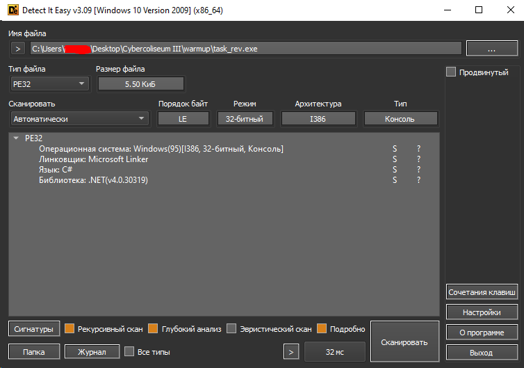
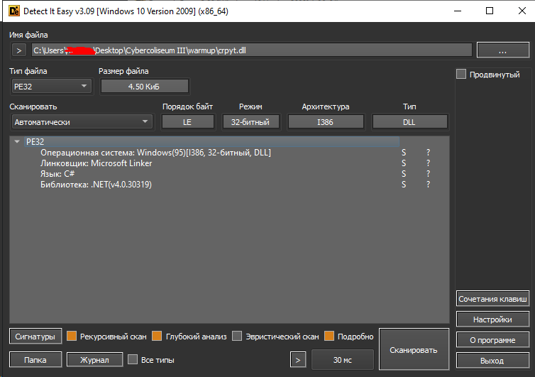
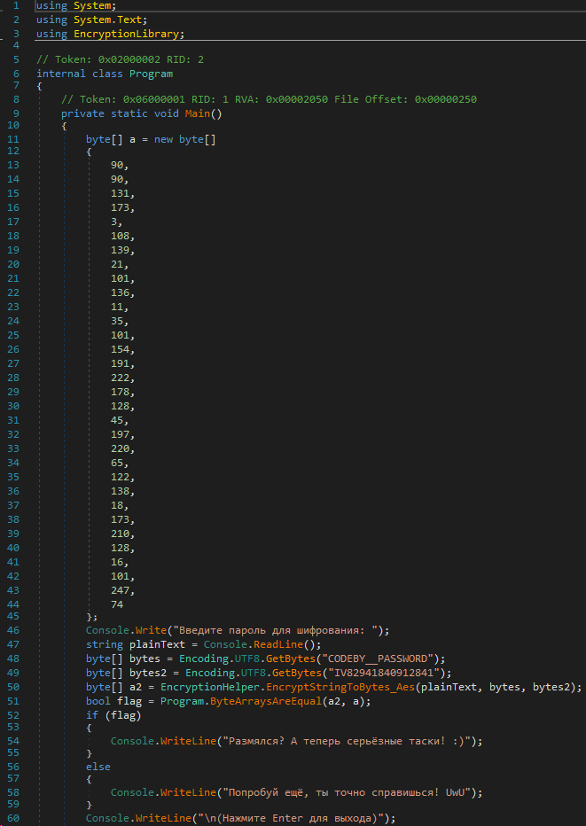
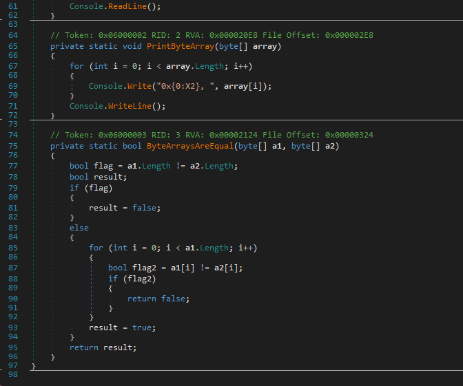

| Название | Категория |        Сложность         |
| :------: | :-------: | :----------------------: |
| Разминка |  Реверс   | $${\color{green}Легко}$$ |

## Анализ программ

Закидываем полученные программу и DLL в Detect It Easy

> [!NOTE]
> DLL — это библиотека, содержащая код и данные, которые могут использоваться несколькими программами одновременно. Например, в операционных системах Windows DLL-библиотека Comdlg32 выполняет общие функции, связанные с диалоговыми окнами. Каждая программа может использовать функции, содержащиеся в этой библиотеке DLL, для реализации диалогового окна Открыть. Это способствует повторному использованию кода и эффективному использованию памяти.

Получаем следующие результаты


Программа и DLL написаны на языке C# на фреймворке .NET v4.0

## Реверс

Для реверса программ, написанных на C# лучше использовать dnSpy
Закидываем оба файла в него. В task_rev.exe видим следующий код


В коде есть массив a, который является зашифрованным флагом. Программа просит нас ввести пароль для шифрования, после чего отправляет его с переменными bytes и bytes2 в функцию EncryptStringToBytes_Aes, которой в самой программе нет. По названию функции несложно догадаться, что используется алгоритм шифрования AES-128 (длина ключа 16 байт)

> [!NOTE]
> AES — симметричный алгоритм блочного шифрования, принятый в качестве стандарта шифрования правительством США по результатам конкурса AES. Этот алгоритм хорошо проанализирован и сейчас широко используется, как это было с его предшественником DES.

Не забываем, что у нас есть ещё DLL, заглянем в него

В ней то как раз и содержится функция EncryptStringToBytes_Aes и понимаем, что bytes - ключ, bytes2 - инициализационный вектор. Покопавшись в документации System.Security.Cryptography по поводу AES узнаем, что по дефолту используется режим шифрования CBC (Cipher Block Chaining)

> [!NOTE]
> CBC - один из режимов шифрования для симметричного блочного шифра с использованием механизма обратной связи. Каждый блок открытого текста побитово складывается по модулю 2 с предыдущим результатом шифрования.

[Решение](solve.py)

## Флаг

```
CODEBY{p@sSw0rd_1n_EXE_anD_DLL}
```
